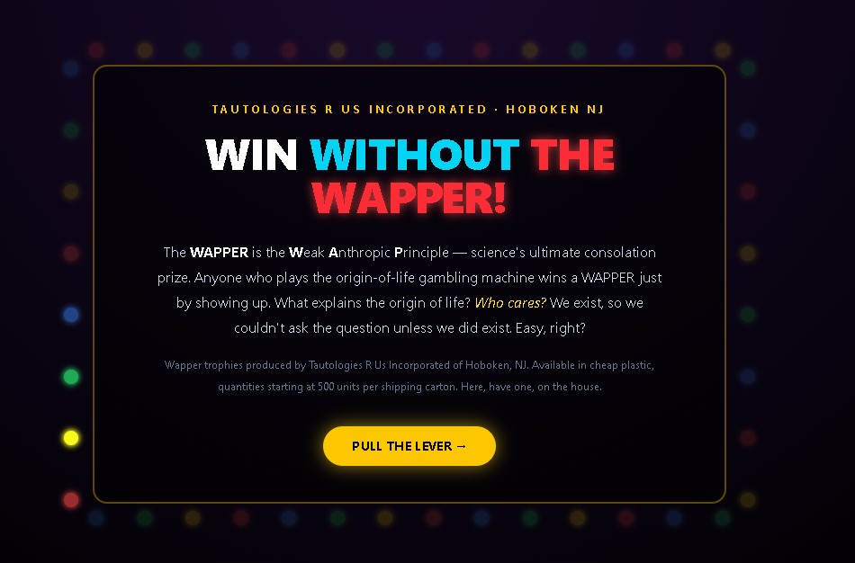

# Origin-of-Life Gamble

A little casino machine that simulates the origin of life. Pull the lever, watch a bunch of environments compete through a chain of lucky breaks, and see who's still standing at the end.

## What's the joke?

There's a famous "explanation" for why life exists at all: **we're here to ask the question, so however unlikely it was, it must have happened.** That's called the **Weak Anthropic Principle** — and around here we call the cheap consolation prize for it the **WAPPER**.

The thing is, that explanation is true *no matter what happens*. Win or lose, succeed or fail, you exist — so by that logic, you "win" automatically. It's not really an explanation, it's a tautology wearing an explanation's clothes. That's the whole gag behind the trophy: everybody gets one, because everybody who's around to receive it already exists.

This app lets you actually run the numbers and feel that joke land for yourself.

## How to play

1. **Set the odds.** Tap "Edit thresholds & settings" to open the controls. Each step in the chain (amino acids forming, a self-copying molecule showing up, a membrane forming, etc.) has its own success probability, from 0% to 100%.
2. **Set how many environments you're testing.** This is like rolling the dice in parallel — more environments, more chances something pulls through.
3. **Hit Run.** Every environment goes step by step through the chain. Each step it either survives or fails, based on the probability you set.
4. **Watch the matrix.** Green checks mean a step succeeded, red X's mean it failed, gold clovers mean the WAP fallback kicked in (more on that below).
5. **See what happened** in the popup that shows up after every run.

## The settings, explained

- **Probabilities** — how likely each step is to succeed. Crank these down and almost everything dies. Crank them up and survival gets easy.
- **Number of environments** — how many parallel "universes" you're testing at once.
- **Apply WAP fallback if all lineages fail** — if every single environment dies out, this option retroactively picks one and pretends it made it the whole way, dashed-line style. It's the app cheating in your favor on purpose, to make the point.

## What you're actually trying to do

The WAPPER popup shows up after every run, because — true to the joke — you *always* technically "win" it. That part's unavoidable. But there's a real challenge hiding underneath:

**Try to win without leaning on the WAPPER.** Don't just settle for one environment limping across the finish line, or the fallback bailing you out. Push the probabilities up until survival is a real, repeatable outcome — not a fluke you have to explain away after the fact.

And keep an eye out for something more interesting: if **more than one** environment survives independently in the same run (no fallback, no fluke), the popup changes tone completely. That's **not** covered by the anthropic hand-wave — the weak anthropic principle only needs *one* success to explain why we're here. Getting two or more independent successes in the same run is a real signal, not a tautology. If you can make that happen reliably, you've found something the WAPPER can't explain away.

## TL;DR

- Low odds + one environment = you'll mostly lose, and the WAPPER will "save" you anyway.
- High odds = you start winning for real.
- Multiple independent survivors at once = you've broken the joke. That's the actual goal.

🏆 *Tautologia Semper Vera Est* — tautologies are always true.